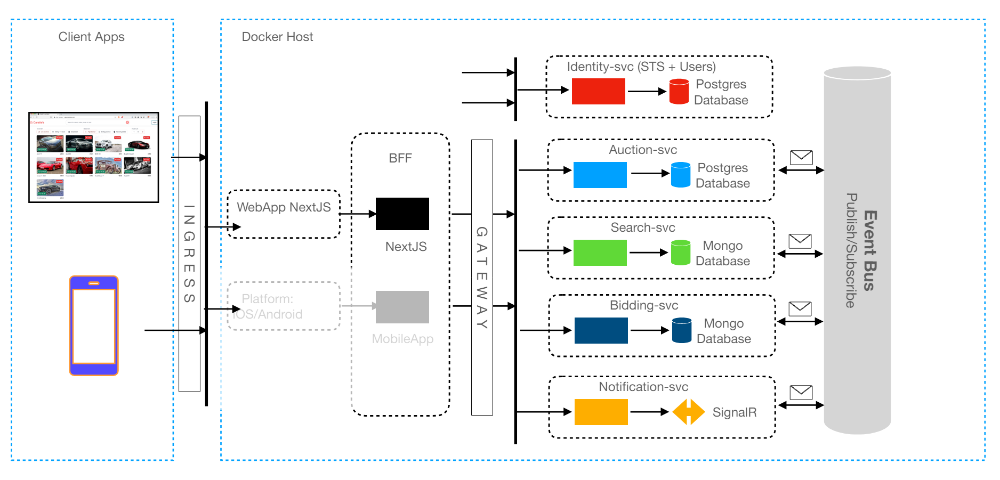

# Auction-house

Microservices based app using .Net, NextJS, IdentityServer, RabbitMQ running on Docker and Kubernetes 

Creating solution file 
1 dotnet new sln -n Auction-house 
Creating Web API project with -o for output directory and --use-controllers for using controllers instead of endpoints 
2 dotnet new webapi -o src/Auction-house --use-controllers 
Put directory in the solution file 
dotnet sln add src/AuctionService 

Give inforamtion about the request(query) and response
"Microsoft.AspNetCore": "Information

# Github

Some information about the github repository and how to use it. 

Show all branches and commits 
git log --all --decorate --onlaine --graph 

Show changes in a branch 
git checkout -b "branch_name" 

Create a new branch 
git branch "branch_name" 

Show all branches 
git branch 

# Create an alias for a command :

git config --global alias."alias_name" "command" 
Exempel: 
Making global command for log --all --decorate --oneline --graph 
git config --global alias.lgb "log --all --decorate --oneline --graph" 
We can now use the command by typing 
git lgb 

# Auction-house Architecture

# Infrastructure

.Net Web API 
Postgres DB 
Entity Framework ORM 
Service Bus - RabbitMQ 

Nuget Packages 
AutoMapper.Extensions.Microsoft.DependancyInjection 
Microsoft.AspNetCore.Authentication.JwtBearer 
Microsoft.EntityFrameworkCore.Design 
Npgsql.EntityFrameworkCore.PostgreSQL 
MassTransit.RabbitMQ 

Queries handled 
ById - Get auction by Id 
All - Get all auctions 
ByStatus - Get auctions by status 
BySeller - Get auctions by seller 
ByBuyer - Get auctions by buyer 

Events emitted 
AuctionCreated - When the auction is created, in response to CreateAuction - 
Emits AuctionDto 

Events consumed 
BidService.BidPlaced - When a bid has been placed in the BidService 
BidService.BiddingFinished - When an auction has reached the AuctionEnd date. 

API Endpoints 
Models 
DTOs 

## Docker

Build the image 
docker compose up -d  
